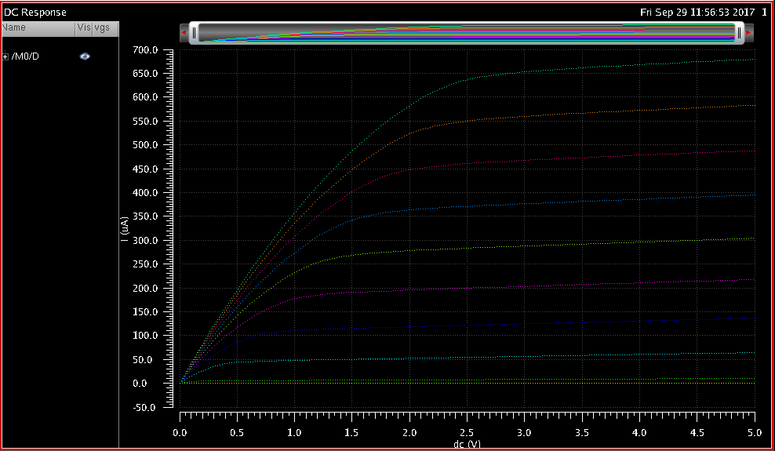

% ECEE 434 Lab 1 - Mosfet Inverter
% Liz MacLean & Carl Anderson
%

# Introduction & Background

Some cool stuff goes here.

# Procedure

For the first portion of the experiment, an NMOS transistor circuit (Fig. 1)
was put under DC analysis at a gate-source voltage of 5V.

After collection a single I-C curve from this transistor, the next test was to vary
VGS from 1 to 5V by 0.5V steps.  This would result in a *family* of I-C
curves to be plotted when tested under a parametric analysis.

Once a single I-C curve and the family of I-C curves were plotted for the NMOS transitor,
the same analyses were run for a PMOS transistor, as seen in Fig. 2.

It should be noted that the PMOS transistor have flipped polarities, thus VDD (V1)
is connected to the bottom of the transistor, and ground is connected to the top.

The second part of the experiment was to demonstrate the concept of hierarchy in circuit design
and simulation.  For this portion, a NMOS and PMOS transistor were connected, and symbolic pins
were added for outside connections. This was then saved as a cell under the name "inverter"
(Fig. 3).  This is the equivalent to making a function in a coding language.

Once the inverter cell was created, it was added to the ECEE 434 component library.  This component
was then used in another circuit, where each of the pins that had been added to the initial cell
(vdd, in, out, gnd) were connected to actual components that would complete the circuit and make it functional.
Figure 4 is the resultant circuit.

The circuit was then put under transient analysis to see the input and output voltages over
the duration of 1µs.

# Results

Whoa check out this photograph:

# Conclusion

