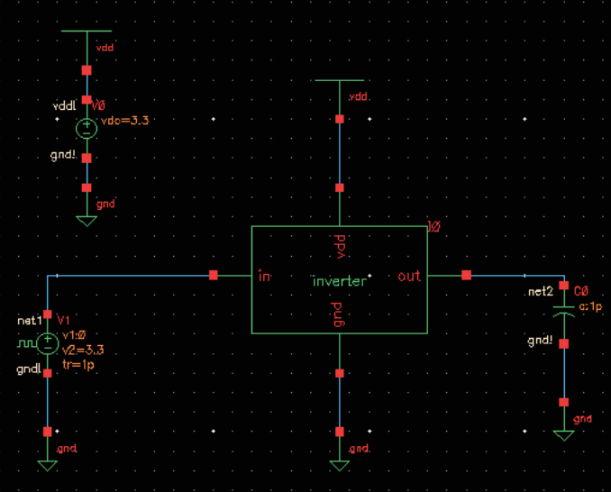
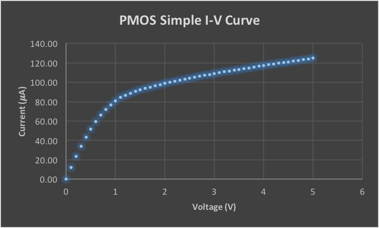

% ECEE 434 Lab 1 - Mosfet Inverter
% Liz MacLean & Carl Anderson
%

# Introduction & Background

Some cool stuff goes here.

# Procedure

For the first portion of the experiment, an NMOS transistor circuit (Fig. 1)
was put under DC analysis at a gate-source voltage of 5V.

After collection a single I-V curve from this transistor, the next test was to vary
V~GS~ from 1 to 5V by 0.5V steps.  This would result in a *family* of I-V
curves to be plotted when tested under a parametric analysis.

Once a single I-V curve and the family of I-V curves were plotted for the NMOS transitor,
the same analyses were run for a PMOS transistor, as seen in Fig. 2.

It should be noted that the PMOS transistor have flipped polarities, thus V~DD~ (V1)
is connected to the bottom of the transistor, and ground is connected to the top.

The second part of the experiment was to demonstrate the concept of hierarchy in circuit design
and simulation.  For this portion, a NMOS and PMOS transistor were connected, and symbolic pins
were added for outside connections. This was then saved as a cell under the name "inverter"
(Fig. 3).  This is the equivalent to making a function in a coding language.

Once the inverter cell was created, it was added to the ECEE 434 component library.  This component
was then used in another circuit, where each of the pins that had been added to the initial cell
(vdd, in, out, gnd) were connected to actual components that would complete the circuit and make it functional.
Figure 4 is the resultant circuit.

The circuit was then put under transient analysis to see the input and output voltages over
the duration of 1 microsecond.

# Results

The result of the DC analysis for the NMOS and PMOS were simple I-V curves (Fig. 5 and 6) that
plotted the drain current, i~D~ versus the drain to source voltage, V~DS~.
When comparing the NMOS simple I-V curve to that of the PMOS, the difference in shape of the
curves despite having equivalent values should be noted.  The NMOS' curve rises more quickly
than that of the PMOS, and also stabilizes moreso, whereas the PMOS curve still rises past
the threshold voltage is reached.

When the transistors were placed under parametric analysis (Fig. 7 and 8) for a multitude of V~GS~ values,
it is even more evident that the PMOS transistor's current evens out slower than that of the NMOS.
This information is relevant because it explains the design preference of NMOS over PMOS transistors
when designing a circuit, as the NMOS is faster due to the carriers being electrons as opposed to holes.
In addition, it is important to realize their differences in behavior for when they are combine in
components such as CMOS transistors.

For the second part of the experiment, where a transient analysis was run on the inverter circuit,
as expected, the input voltage of the circuit was successfully inverted, as seen in Figure 9.

While the input is perfectly square, as chosen when making the circuit, the output voltage has curved
rising and falling edges.  This is due to the nature of NMOS and PMOS components.  Although there is a
clear point at which the voltage switches the behavior of the transistor from open to closed and
vice-versa, there is still a time of adjustment before the transistor reaches true saturation, thus
the rounded edges.

# Conclusion

