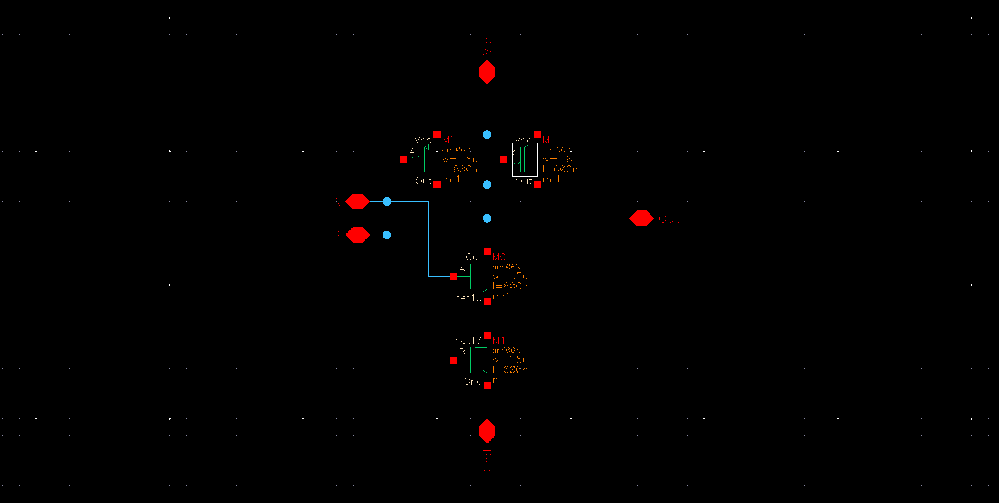
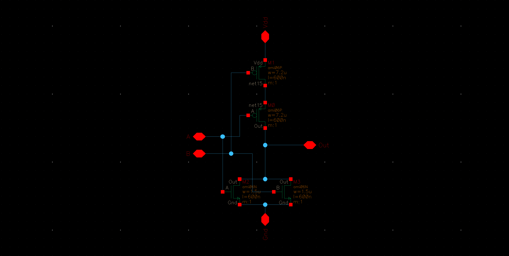
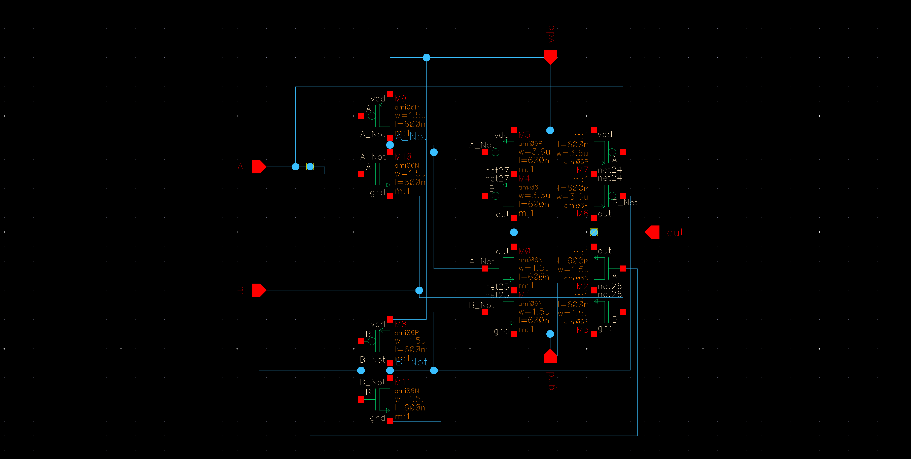

% ECEE 434 Lab #3 - Logic Gates
% Liz MacLean & Carl Anderson
%

\pagebreak

# Introduction & Background

This lab was designed with the intention of giving students a deeper understanding of
worst case scenarios and propagation delays of NMOS and PMOS transistors.  For this
experiment, students were asked to create three logic gates, specifically a NAND, NOR,
and XOR.  These were then assessed for the worst case scenario, or the scenario where the
least number of transistors were shut off.  Once determined, the equivalent resistances of
these scenarios for both the pull down and pull up networks would be found, and evaluated
in order to get equivalent rising and falling propagation delays, under 1 nanosecond.

\pagebreak

# Procedure

The goal of this lab is to have the rising and falling propagation delays be equivalent.
Since we are adjusting the size of the transistors for this design requirement to be true,
the most straightforward way of calculating them is using the propagation time equations.

$$t_{PHL} = 0.69*R_n*C_{load}$$

$$t_{PLH} = 0.69*R_p*C_{load}$$

Based off of these equations, the only unknowns are the resistance values for the
transistors, $R_N$ and $R_N.

$$R_N = \frac{12.5}{(W/L)_n}$$

$$R_P = \frac{30}{(W/L)_p}$$

Each circuit had its own worst case scenario that affected the equivalent resistances of the pull
up and pull down networks.

\pagebreak

## NAND Gate

For the NAND gate (Fig. 1) the worst case scenario was when only one PMOS
transistor was on, and two NMOS transistors were on.  Thus, in order for both networks to have
equivalent propagation delays and equivalents resistances, the equivalent resistances of the pull up
and pull down worst case networks had to be set to each other, as opposed to the best case scenario
resistances.  For the NAND circuit, this would be:

$$R_P = 2R_N$$

After setting $R_n$ equal to $R_p$ so that the $t_{PLH}$ and $t_{PHL}$ values would be equivalent,
the ratio of p to n for the NAND gate was:

$$p = 1.2n$$

Since the default width for the transistors in Cadence is $1.5\mu m$, that value was chosen for
the n-type transistor, and then p was calculated to be $1.8\mu m$.

\pagebreak

## NOR Gate

For the NOR gate (Fig. 2), the worst case scenario was when two PMOS transistors were on, and one
NMOS transistor was on.  When the equivalent resistances were set to eachother, the resultant
equation was as follows:

$$2R_P = R_N$$

After setting $R_n$ equal to $R_p$ so that the $t_{PLH}$ and $t_{PHL}$ values would be equivalent,
the ratio of p to n for the NOR gate was:

$$p = 4.8n$$

Since the default width for the transistors in Cadence is $1.5\mu m$, that value was chosen for
the n-type transistor, and then p was calculated to be $7.2\mu m$.

\pagebreak

## XOR Gate

The worst case scenario for the XOR gate (Fig. 3) is similar to that of the inverter, where the number of
transistors in the pull up network were equivalent to the number of transistors in the pulldown network.
When the equivalent resistances were set to eachother, the resultant
equation was as follows:

$$2R_P = 2R_N$$

Which can be simplified to $2R_P = 2R_N$. After setting $R_n$ equal to $R_p$ so that the $t_{PLH}$
and $t_{PHL}$ values would be equivalent, the ratio of p to n for the NOR gate was:

$$p = 3.6n$$

Since the default width for the transistors in Cadence is $1.5\mu m$, that value was chosen for
the n-type transistor, and then p was calculated to be $3.6\mu m$.

\pagebreak

# Results

\pagebreak

# Conclusion

