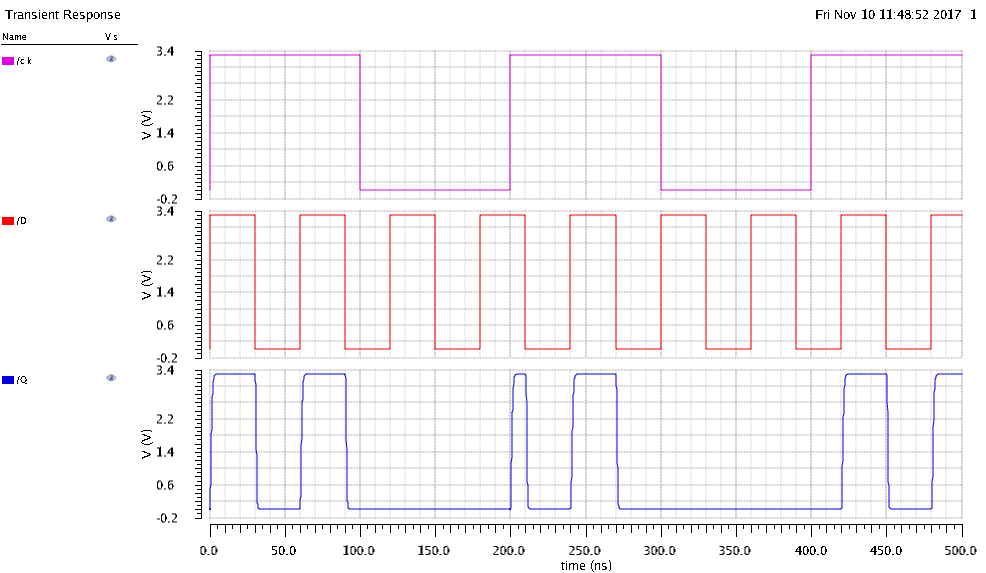

% ECEE 434 Lab #4 - D-latch
% Liz MacLean & Carl Anderson
%

\pagebreak

# Introduction & Background

A D-latch circuit is a combination circuit consisting of CMOS inverters, transmission
gates, and a clock signal. This circuit will transmit the signal on the D input line
to the Q output when the CLK signal is high. This is useful in the case of noise, as
it results in short changes to the input to not affect the output.  In addition,
D-latches are used for storing states, specifically when the clock is low. Storing the
state can be useful when using chip select on a specific chip that is used for multiple things.

\pagebreak

# Procedure

This lab experiment began with creating the D-latch circuit shown in Fig 1 as well as
the lab writeup. The circuit uses three inverters (created in previous labs), two transmission
gates, and a clock driving the circuit.  The starting period was chosen to be 200ns, which
translates to 5Mhz, and the transistor sizes were all left at the default sizes.

Next, clock inputs were provided to the circuit along with a square wave used to represent
data input. The function of the circuit was then observed using Virtuoso's simulator. After
proper operation was verified, the clock frequency was increased to a failure point. The failure
was then analyzed to determine what caused the circuit to fail.

\pagebreak

# Results

For the initial reading of the D-Latch data, where no failure was expected, the input of
the clock, clk, as well as the data line, D, resulted in a correct reading for the output, Q (Fig. 2).
As anticipated, when the clock and the data line were high, so was the input, and when the
clock was low, no matter the data line, the output Q remained what it was when the clock was high.

In contrast, when the frequency was high enough that it broke the behavior of the D-Latch,
*WHAT HAD HAPPENED WAS....  This frequency is related to the rising and falling time of the output,
because if the frequency is higher than the inverse of either of those times, there is no way the
circuit could keep up with the clock and the inputs.*

\pagebreak

# Conclusion

In conclusion Liz is the coolest and by association so is Carl 😎 

The purpose of this experiment was not only to understand the functionality of the D-Latch,
but to also understand the limitations of it.  If this flip-flop were to be used in the field,
knowing that it has a maximum frequency, and not going over that will be very helpful in the
design of the circuit and the components surrounding it.  In addition, seeing the digital output
is very different from simply looking at a truth table, and gives a deeper comprehension to how
circuits like the D-Latch work.

