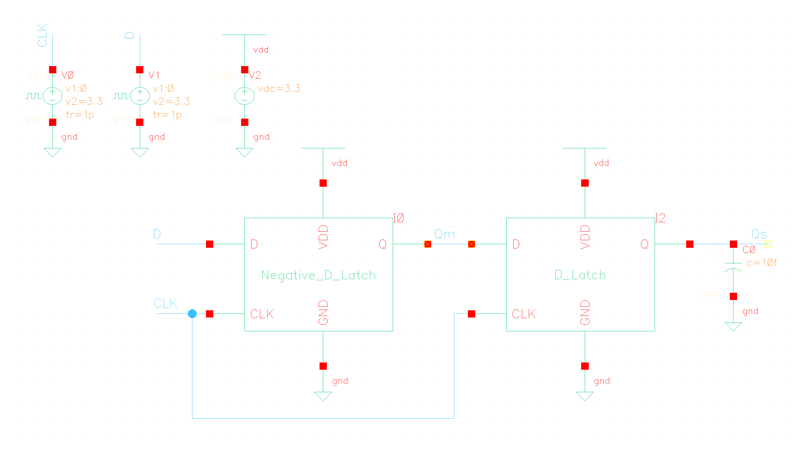
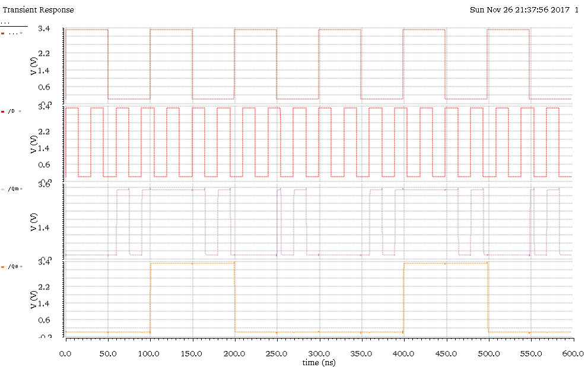

% ECEE 434 Lab #5 - Positive/Negative Flip-flop
% Liz MacLean & Carl Anderson
%

\pagebreak

# Introduction & Background

The previous experiment introduced the use of D-latches, how they operate, and their limitations. This experiment introduces a different kind of
latch called a flip-flop. A flip-flop differs from a latch in that it registers data while the clock is rising, rather than when it is high. A negative 
version can also be created. 

The purpose of this experiment is to build a positive flip-flop and characterize it. The D-latch from the previous experiment,
and a negative D-latch, is used in this one to create the new circuit. 

In order to characterize the positive flip-flop two specific measurements will be considered. The first is "setup-time." Setup-time
is defined as the minimum amount of time before the clock's leading edge that the data must be stable for it to be latched correctly. 
Data that is switched in violation of the setup-time parameter will not have time to propagate through the circuit.

The second parameter is called "hold-time." Hold-time is defined as the minimum amount of time after the clock's leading edge during which
the data must be stable. The effect is similar to the setup-time. 

\pagebreak

# Procedure

In order to achieve the objective of this experiment, the following procedure was followed:

*   Build a negative latch and show its functionality. 
    *   Use the latch circuit from the previous experiment
    *   Simulate its output using Spectre and show the graph. 
*   Build a positive flip-flop and show it's functionality
*   Using the defitions of hold time and setup time for flip-flops, characterize the flip-flop using those measurements. 

\pagebreak

# Results

The overall circuit can be seen in Fig. 1. Before this circuit was built, first a negative latch was created using the D-latch from the previous experiment. However, the difference from previous was the addition
of an inverter to the input of the D-latch within the circuit. This is not seen in the schematic, because it was built in to the symbol. The
operation of the Negative D-latch can be seen in Fig. 2 on the Qm graph. Only when the clock is negative will the data be accepted into the circuit, which
is reflected in the output plot. 

Further, the operation of the D-flip-flop can be seen at the Qs output. The output data changes only on the leading edge of the input clock. Otherwise, the output is constant. 

\pagebreak

# Conclusion

Some cool stuff happened. 

